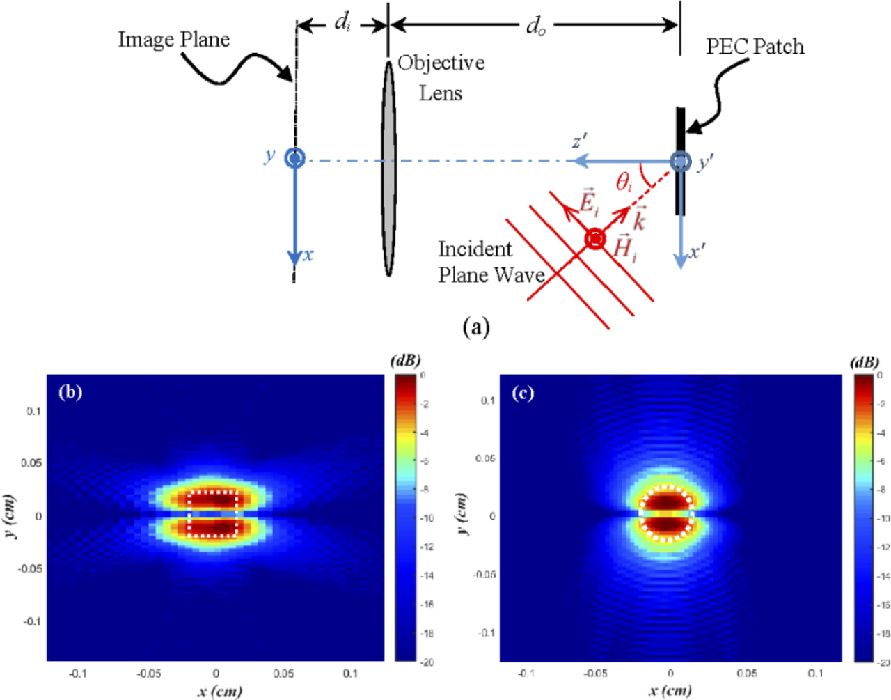

# Overview

 This Matlab code is part of the MSc project " Improving the Quality of THz Stand-off Imaging Using Polarimetry Technique" and calculates the backscattered electromagnetic waves from a PEC square
 using the Physical Theory of Diffraction. 
 The objective is to enhance edge detection and background suppression, particularly for metallic objects. The underlying concept is based on the analysis of scattering behavior from perfectly conducting (PEC) patches, revealing that cross-polarized scattering is a valuable source of information about object edges.
 # Electromagnetic calculations
 1. First, the backscattered electromagnetic waves from a PEC square is calculated in the nearfield, using the Physical Theory of Diffraction.
 2. Then the image reconstruction is implemented using Quadratic phase approximation and Fresnel Diffraction Integral.

# Output
The schematic of the simulation and output of the code is the image below:

# Citation:
Please explore the full project in our paper:
”Improving the quality of active millimeter-wave standoff imaging by
incorporating the cross-polarized scattering”, Optics Express, URL:
https://doi.org/10.1364/OE.436363
